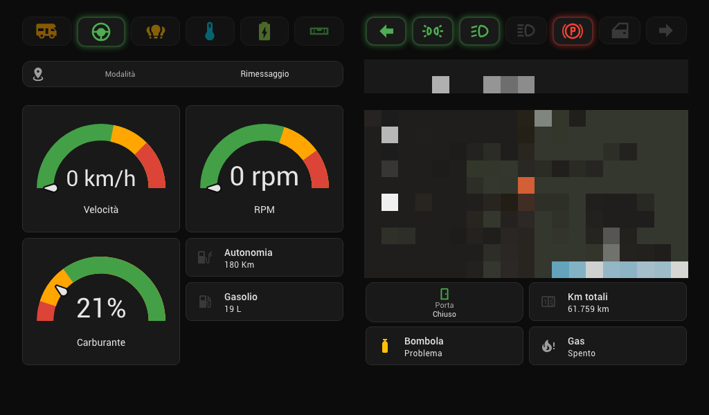
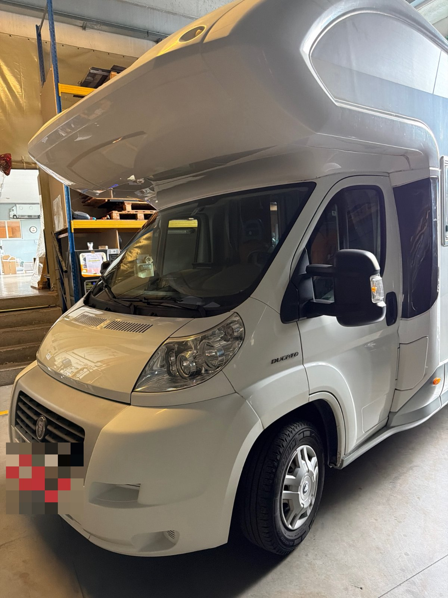
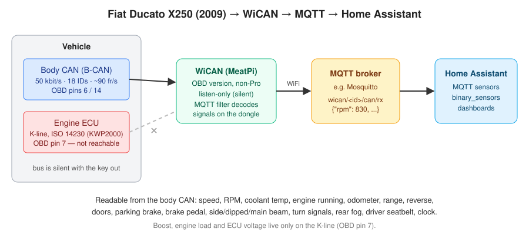
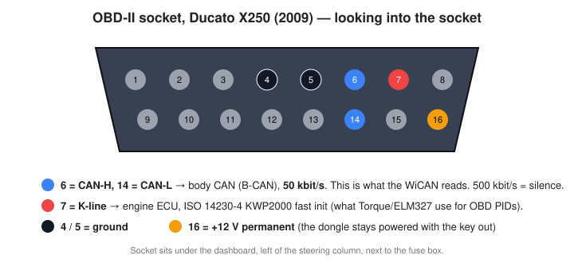
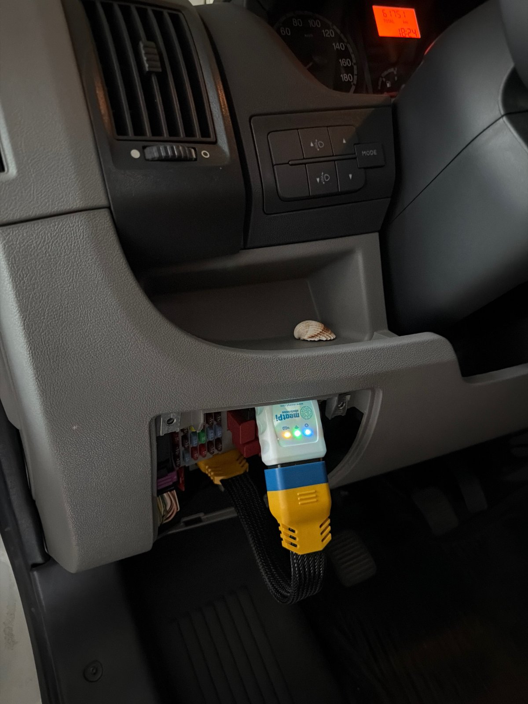
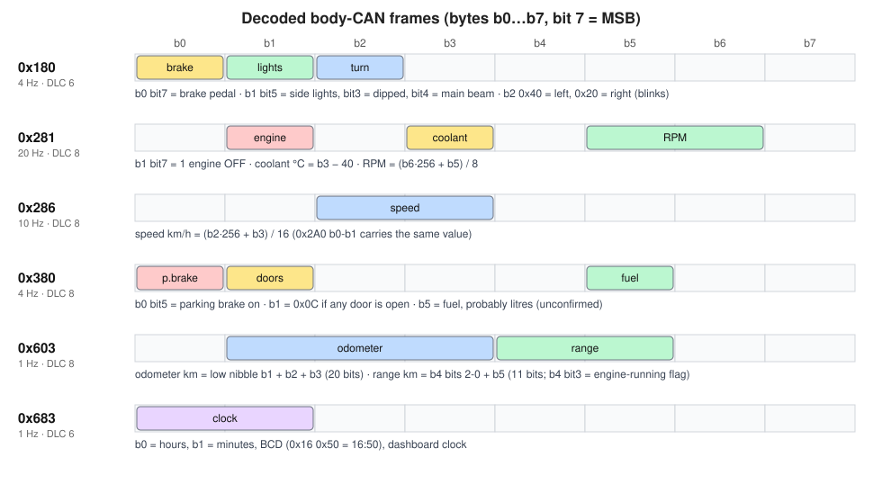
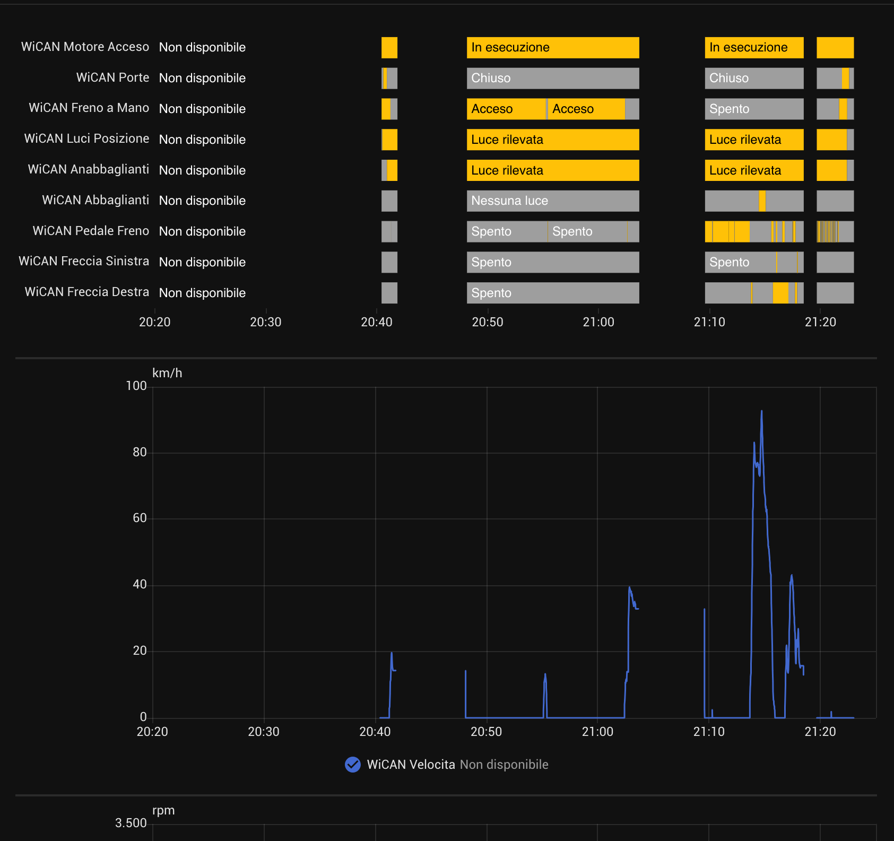

# Fiat Ducato X250 body-CAN with a WiCAN → Home Assistant

Decoded **CAN IDs of the Fiat Ducato X250** (2009) body CAN, plus a step-by-step guide to read them with a **MeatPi WiCAN** OBD dongle and use them in **Home Assistant** over MQTT. No cloud, no app, listen-only.

What you get from the OBD socket, live while the ignition is on:

**speed · RPM · coolant temperature · engine running · odometer · range · doors · parking brake · brake pedal · reverse gear · driver seatbelt · trip computer (instant / average consumption, trip distance, time, average speed) · side lights · dipped / main beam · rear fog · turn signals · dashboard clock**


*Home Assistant dashboard on the head unit: gauges and the row of "tell-tales" (turn signals, lights, parking brake, doors) come from the CAN bus. For this screenshot the tell-tale states were injected by hand while parked; the other values are real.*

> ⚠️ Read the [disclaimer](#disclaimer) before plugging anything into your vehicle.

---

## Contents

- [Vehicle](#vehicle)
- [How it works](#how-it-works)
- [The OBD socket](#the-obd-socket)
- [CAN ID table](#can-id-table)
- [Step-by-step setup](#step-by-step-setup)
- [Home Assistant](#home-assistant)
- [Gotchas](#gotchas)
- [Sniffing it yourself](#sniffing-it-yourself)
- [Contributing](#contributing)
- [Disclaimer](#disclaimer)
- [How this was made](#how-this-was-made)

## Vehicle

| | |
|---|---|
| Base vehicle | **Fiat Ducato X250**, 2.3 MultiJet diesel |
| Model year | **2009** (first-series X250, analogue cluster with orange LCD) |
| Body | Elnagh Prince 55L, overcab motorhome (7.15 m) |
| Market | Italy (EU) |
| Engine ECU protocol | ISO 14230-4 KWP2000 on the K-line |
| OBD CAN pins 6/14 | body CAN, 50 kbit/s |



The same platform is sold as **Citroën Jumper** and **Peugeot Boxer** (2006–2014); only the Ducato above has been tested.

## How it works



- The OBD socket of this Ducato does **not** carry the engine CAN. Pins 6/14 carry the **body CAN at 50 kbit/s**, and at 500 kbit/s there is nothing. The engine ECU talks OBD over the **K-line** (pin 7).
- Many engine values are still broadcast on the body CAN for the instrument cluster (RPM, coolant, speed, odometer, range), so a CAN-only dongle can read them by **listening**, without sending a single OBD request.
- The WiCAN decodes the frames itself (its "MQTT filter" feature) and publishes plain JSON such as `{"rpm": 830, "coolant_c": 81}` to an MQTT broker. Home Assistant turns each field into a sensor.

## The OBD socket



The socket is under the dashboard, left of the steering column, next to the fuse box:



*WiCAN plugged in through a short flat OBD extension so it doesn't get kicked. The cluster above shows the odometer that the CAN value was checked against.*

## CAN ID table



| ID | Signal | Decoding |
|---|---|---|
| `0x180` | brake pedal | `b0` bit 7 |
| `0x180` | side lights / dipped / main beam | `b1` bit 5 / bit 3 / bit 4 |
| `0x180` | rear fog light | `b1` bit 1 |
| `0x180` | turn signal left / right | `b2` `0x40` / `0x20` (blinks) |
| `0x281` | engine running | **RPM > 300** (don't use `b1` bit 7, see Gotchas) |
| `0x281` | coolant temperature | `b3 − 40` °C |
| `0x281` | RPM | `(b6·256 + b5) / 8` |
| `0x286` | speed | `(b2·256 + b3) / 16` km/h (also `0x2A0` `b0-b1`) |
| `0x380` | parking brake | `b0` bit 5 |
| `0x380` | any door open | `b1 = 0x0C` |
| `0x380` | reverse gear | `b2` bit 2 |
| `0x39A` | driver seatbelt | `b2` bit 0, **1 = unbuckled** (also `0x3C3` `b4` bit 1) |
| `0x603` | odometer | 20 bits from `b1` low nibble → km |
| `0x603` | range | 11 bits: `b4` bits 2-0 + `b5` → km |
| `0x603` | instant consumption *(to be verified while driving)* | `b0` + `b1` high nibble, BCD → L/100km (`11 6x` = 11.6) |
| `0x643` | trip: average consumption | `b0` + `b1` high nibble, BCD → L/100km |
| `0x643` | trip: average speed | `b2` km/h |
| `0x643` | trip: time | `b3` hours, `b4` minutes, BCD |
| `0x643` | trip: distance | 20 bits: `b5`, `b6`, `b7` high nibble → × 0.1 km |
| `0x683` | dashboard clock | `b0` h, `b1` min, BCD |

Full details and verification notes: [docs/can-id-reference.md](docs/can-id-reference.md).

## Step-by-step setup

Tested with a **WiCAN OBD (non-Pro), firmware 4.13**.

### 1. Put the WiCAN on your network

Plug it in, connect to its access point (`WiCAN_xxxxxx`), open `http://192.168.80.1` and set **WiFi mode = AP+Station** with your van / home WiFi. Give it a fixed IP in your router (DHCP reservation): it makes everything below easier.

### 2. CAN settings

In the WiCAN web UI:

| Setting | Value | Why |
|---|---|---|
| CAN bitrate | **50K** | the body CAN speed; 500K shows nothing |
| CAN mode | **Silent** | listen-only: the dongle never transmits on the bus |
| Protocol | anything for now; `slcan` if you want to sniff (see below) | |

### 3. MQTT

Enable MQTT and point it to your broker (e.g. the Mosquitto add-on of Home Assistant). Note the RX topic it shows, `wican/<device_id>/can/rx`.

### 4. Load the decoding filter

The WiCAN can decode frames on the device and publish only the values ("MQTT filter"). Upload [`wican/can_filter.json`](wican/can_filter.json) through the web UI, or from a shell:

```bash
curl -X POST --data-binary @wican/can_filter.json http://<wican-ip>/store_canflt
curl http://<wican-ip>/load_canflt        # check it is stored
curl -X POST -d reboot http://<wican-ip>/system_reboot
```

Filter fields: `CANID` in decimal (`641` = `0x281`), `StartBit` counted from the **MSB of `b0`** (bit 7 of `b0` = `StartBit 0`, bit 7 of `b1` = `StartBit 8`), `BitLength`, `Expression` (`V` = the extracted value, `B5` = byte 5), `Cycle` = publish period in ms.

> Several entries on the same ID work (`0x281` has three), but in our tests separate bit entries on `0x180` did not all publish reliably, so lights, brake pedal and turn signals are read as one 24-bit `raw_180` value and split in Home Assistant.

### 5. Check the output

```bash
mosquitto_sub -h <broker> -u <user> -P <pass> -t 'wican/+/can/rx' -v
```

With the key in MAR you should see `{"speed_kmh":0}`, `{"rpm":0}`, `{"coolant_c":16}`… every second.

## Home Assistant

1. Copy [`homeassistant/mqtt_wican.yaml`](homeassistant/mqtt_wican.yaml) next to `configuration.yaml`, replace `<device_id>`, and add `mqtt: !include mqtt_wican.yaml` (or merge it into your existing `mqtt:` section).
2. Copy [`homeassistant/template_turn_signals.yaml`](homeassistant/template_turn_signals.yaml) and add `template: !include template_turn_signals.yaml`.
3. Reload MQTT and template entities (Developer tools → YAML).

Real data from a short evening drive, as recorded by Home Assistant:



*History panel (Italian UI): engine running, doors, parking brake, side lights, dipped/main beam, brake pedal, turn signals, and the speed trace. The brake pedal and blinkers are clearly visible around the stops.*

## Gotchas

- **The bus is completely silent with the key out.** Nothing can be read while parked. Live sensors use `expire_after: 15` so they go `unavailable` instead of freezing; hide them in dashboards with a `visibility` condition (`state_not: [unavailable, unknown]`).
- **The last frame at key-off lies.** Just before going silent the bus sends one frame with odd values: parking brake released, engine still running. Don't build automations on the key-off edge.
- **Don't use `0x281` `b1` bit 7 as "engine running".** It is `1` only with the ignition on and the engine stopped. At key-off (STOP) it reads "running" in the last frame, and after a drive the engine ECU keeps sending `0x281` for ~20 s with the bit at "running" and RPM at 0. RPM > 300 is right in every case (tested 3 times: key-on only, start/stop, stop after running).
- **Odometer and range have no expiry**, so they keep the last value while parked, but they become `unknown` after a Home Assistant restart or MQTT reload until the next ignition. Add `retain` on your side if that matters.
- **Doors**: on this motorhome cab doors, habitation door and lockers share one circuit, so `0x380` `b1` only says "some door is open".
- **Boost, load, intake temperature, ECU voltage and DTCs are not on this bus** (K-line only).
- **WiCAN sleep**: with sleep enabled it sleeps below 13.1 V for 16 min and wakes above 13.5 V (engine running), which avoids draining the starter battery.

## Sniffing it yourself

Set the WiCAN to **Protocol = slcan, Port type = TCP, Port = 23**, then:

```bash
python3 tools/slcan_capture.py <wican-ip> 60 my-capture.slcan.txt
python3 tools/decode.py my-capture.slcan.txt          # known signals, changes only, CSV
python3 tools/decode.py --test                        # self-check of the decoder
```

The script sends `C`, `S2` (50 kbit/s) and `L` (listen-only) and records every frame. Five real captures of this van (idle, doors & lights, driving…) are in [`captures/`](captures/).

## Contributing

**Found a new CAN ID, a better decoding, or data from another Ducato / Jumper / Boxer? Please share it.** Open an issue with the *New CAN ID* template or send a pull request. The process, and what not to post (VIN, plate, GPS, passwords), is in [CONTRIBUTING.md](CONTRIBUTING.md).

## Disclaimer

This is a **hobby project**, shared for information only, with **no warranty of any kind** (see [LICENSE](LICENSE)).

- Connecting anything to the OBD port and the vehicle's CAN bus is **at your own risk**. A faulty device or wrong settings can drain the battery, cause warning lights, disturb other control units or, in the worst case, affect vehicle behaviour. The author accepts **no liability** for any damage to vehicles, equipment, data or people.
- Everything here is **listen-only**. Do not transmit on the bus unless you fully understand the consequences.
- Decodings come from **one vehicle** and may be wrong or different on yours. Do **not** rely on them for anything safety-related, and never let a dashboard distract you while driving.
- Check that a permanent OBD device is allowed by your local rules, insurance and warranty.
- Fiat, Ducato, Citroën, Jumper, Peugeot, Boxer, Elnagh, WiCAN, MeatPi and Home Assistant are trademarks of their respective owners. This project is **not affiliated** with or endorsed by any of them.

## How this was made

This project was done together with an AI coding agent ([Claude Code](https://claude.com/claude-code) by Anthropic). The agent drove the WiCAN captures over the network, searched the recordings for changing bytes, proposed the decodings, wrote the tools and the Home Assistant configuration, and drafted this documentation.

Every action in the captures (doors, lights, pedals, engine, the drive) was done by hand on the real vehicle, and every decoding in the "decoded" table was checked against the instrument cluster, GPS or the OBD values before being listed. Anything not confirmed that way is left out. If you find a mistake, please [open an issue](../../issues).

## License

[MIT](LICENSE)
